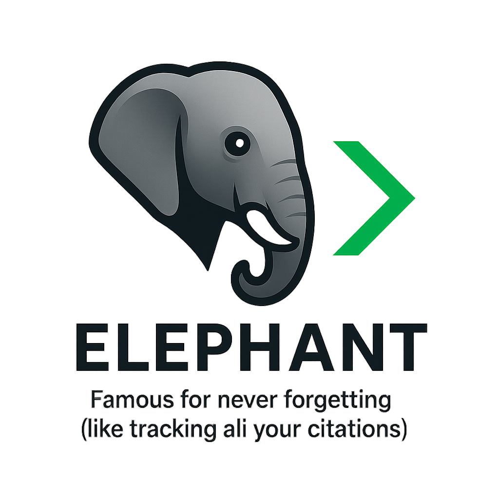

<div align="center">
  

  # 🐘 Elephant

  **Never forget your citations.**

  A command-line tool to track, analyze, and boost your scientific citations across multiple platforms.

  [](https://opensource.org/licenses/MIT)
  [](https://www.python.org/downloads/)

</div>

## Features

- 📊 Track citations across ORCID, Web of Science, arXiv, and more
- 📈 Monitor citation growth over time
- 💡 Get actionable recommendations to increase visibility
- 🎯 Identify under-cited papers needing promotion
- 🔍 Discover relevant communities and researchers
- 📅 Track submission and publication metrics

## Supported Platforms

- ORCID
- arXiv
- Google Scholar
- Semantic Scholar
- CrossRef
- MDPI, Elsevier, Nature (via CrossRef/DOI)
- Web of Science (requires institutional access)

## Installation

```bash
pip install -r requirements.txt
python setup.py install
```

## Quick Start

```bash
# Initialize your profile
elephant init

# Fetch latest metrics
elephant fetch --all

# View dashboard
elephant dashboard

# Get recommendations
elephant recommend

# Track specific paper
elephant track --doi "10.1234/example"
```

## Commands

- `init` - Set up your accounts and API keys
- `fetch` - Fetch latest data from platforms
- `dashboard` - View your citation metrics
- `recommend` - Get suggestions to boost citations
- `track` - Track specific papers
- `export` - Export data to CSV/JSON
- `alert` - Set up citation alerts

## Why Elephant? 🐘

Elephants are famous for their incredible memory - they never forget. Just like an elephant, this tool remembers and tracks all your citations, publications, and metrics across multiple platforms, so you never miss an opportunity to boost your research impact.

## Contributing

Contributions are welcome! Please feel free to submit a Pull Request.

## License

MIT License - see LICENSE file for details

## Acknowledgments

Built with ❤️ for researchers who want to maximize their academic impact.
